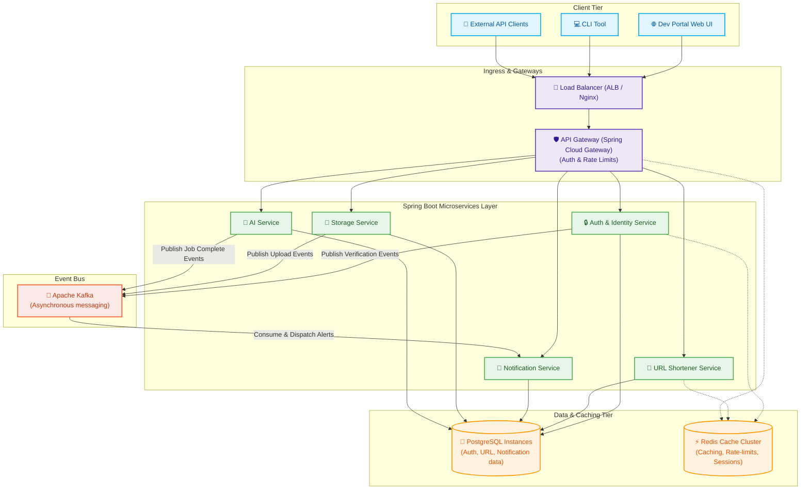

# Developer Platform Ecosystem - Glowing Production Architecture & LinkedIn Post

Here is the complete Production-Grade (Enterprise Scaled) Developer Ecosystem Architecture Diagram and LinkedIn post copy for Chapter 2 of your **Build in Public** series!

---

## 🏗️ Developer Ecosystem Architecture Diagram

Below is the diagram representing a highly-scaled, event-driven microservices deployment pattern for the complete developer platform.



### 🖼️ High-Quality Visual Diagram
You can download the generated high-quality PNG image inside your workspace root at:
[glowing_developer_ecosystem_architecture.png](file:///home/mangesh/Mangesh_Thakur/Projects/developer-platform/glowing_developer_ecosystem_architecture.png)


---

## 📝 LinkedIn Post Copy

```text
🚀 Building Developer Platform | Chapter 2: The Production Architecture 🏗️

In my last post, I shared the planning workflow that laid the foundation for our Developer Platform. Today, we’re looking at the complete production-grade architecture of our developer ecosystem! 🔍

Before writing a single service-level line of code, I wanted to design a highly available, event-driven, and scalable microservices system. 

Here is how the developer ecosystem architecture is structured:

1️⃣ The Entrance & Gatekeeper:
• A high-performance Load Balancer (ALB) handles ingress traffic.
• It routes requests directly to our API Gateway (built with Spring Cloud Gateway) which acts as the front-door, intercepting requests to handle rate-limiting, security validation, and request routing.

2️⃣ Spring Boot Microservices Layer:
Our platform is divided into five dedicated Spring Boot services, each running in horizontally-scaled containers:
• 🔒 Auth & Identity Service (Users, Workspaces, Projects, API Keys)
• 🔗 URL Shortener Service (Lightning-fast link redirections)
• 🔔 Notification Service (Multi-channel email, SMS, and Webhooks)
• 📂 Storage Service (Object storage, uploads, and CDN integration)
• 🧠 AI Service (AI APIs, semantic search, RAG, and embeddings)

3️⃣ Event-Driven Messaging:
Rather than blocking HTTP request-response threads, microservices communicate asynchronously via Apache Kafka. For example, when a file is uploaded to the Storage Service or a job completes in the AI Service, an event is published to Kafka, and the Notification Service consumes it to alert the client.

4️⃣ Caching & Relational Data Tier:
• PostgreSQL instances act as the source of truth for relational configurations.
• A clustered Redis cache layer holds session tokens and active API key lookups, maintaining a fast, stateless application tier.

Designing with scalability in mind from day one ensures that as developers plug into our services, the ecosystem can grow seamlessly. Up next: I'll be sharing how we implement the API Key verification security filter and the URL Shortener logic!

What are your thoughts on using Spring Cloud Gateway vs Nginx/Envoy as the gateway for Spring Boot microservices? Let's discuss in the comments! 👇

#BuildInPublic #BackendEngineering #SystemDesign #SoftwareArchitecture #Java #SpringBoot #PostgreSQL #Redis #Kafka #Microservices
```
